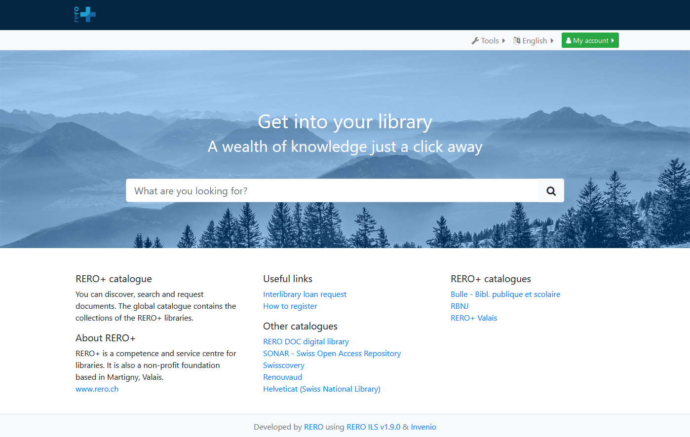

<!--
SPDX-FileCopyrightText: Fondation RERO+
SPDX-License-Identifier: AGPL-3.0-or-later
-->

<!-- PROJECT SHIELDS -->

<!-- PROJECT LOGO -->
 

  

<h2 align="center">RERO ILS</h2>

  

    The elegant solution for heritage, public and school libraries or networks.
     
    <a href="https://ils.test.rero.ch/"><strong>Live Demo »</strong></a>
    ·
    <a href="https://bib.rero.ch/help/home/"><strong>User docs »</strong></a>
    ·
    <a href="https://github.com/rero/developer-resources"><strong>Developer docs »</strong></a>
     
     
    <a href="https://www.rero.ch/produits/ils">Website</a>
    ·
    <a href="https://github.com/rero/rero-ils/issues">Report Bug</a>
    ·
    <a href="https://github.com/rero/rero-ils/issues">Request Feature</a>
  

<!-- TABLE OF CONTENTS -->

  
Table of Contents

  <ol>
    <li>
      <a href="#about-the-project">About The Project</a>
      <ul>
        <li><a href="#rero-ils">RERO ILS</a></li>
        <li><a href="#built-with">Built with</a></li>
      </ul>
    </li>
    <li>
      <a href="#usage">Usage</a>
      <ul>
        <li><a href="#demo">Demo</a></li>
        <li><a href="#features">Features</a></li>
        <li><a href="#use-rero-ils">Use RERO ILS</a></li>
      </ul>
    </li>
    <li><a href="#getting-started">Getting started</a></li>
      <ul>
        <li><a href="#install">Install</a></li>
        <li><a href="#the-ecosystem">The ecosystem</a></li>
      </ul>
    <li><a href="#contact">Contact</a></li>
  </ol>

 

# About the project

  

 

## RERO ILS

RERO ILS is a new generation open source [integrated library system](https://en.wikipedia.org/wiki/Integrated_library_system) developed in Switzerland by [RERO+](https://rero.ch/) in collaboration with the Catholic University of Louvain ([UCLouvain](https://uclouvain.be/)). It allows the management of library networks or independent libraries (document acquisition, circulation, cataloguing, search) and offers a public interface for users.

RERO ILS has been under heavy development since 2017 as a replacement for RERO network's legacy software. Its first major release (`v1.0.0`) was published at the end of 2020. The first real-life production instance has been live since June 2021. Since then, it is being actively maintained and developed by a committed team of professionals from Switzerland, in order to improve upon its current features and satisfy its users' needs.

## Built with

(<a href="#top">back to top</a>)

# Usage

## Demo

To explore the system, you can try the [test instance](https://ils.test.rero.ch/) or take a look at one of the production instances: [RERO+ network](https://bib.rero.ch/) (live since Summer 2021) and [UCLouvain network](https://ils.bib.uclouvain.be/) (live since early 2022).

## Features

* :globe_with_meridians: **Consortial model:** built primarily for library networks, large or small, with several levels of configuration included (organization, library).
* :books: **Cataloguing and serial management:** modern cataloguing editor in compliance with current standards (RDA, BibFrame); in-depth management of periodicals, subscriptions, and issue predictions.
* :computer: **Online catalog:** public online catalog with simple but powerful search and filtering functions; customizable views by organization and library; seamless integration of resources from external platforms (ebooks, databases, etc.).
* :book: **Circulation module:** perform all the operations required by libraries: check-out, check-in, item requests, interlibrary loans, patron management, in a modern, fast and ergonomic web interface.
* :arrows_clockwise: **Data interaction and openness:** JSON formatted bibliographic data [Bibframe model](https://www.loc.gov/bibframe/) with a powerful API to interact with the database.

## Use RERO ILS

RERO ILS is open source and can be can be deployed and hosted by anyone, provided they can afford the required configuration or development effort. It can also be hosted [*as a service*](https://www.rero.ch/en/products/ils#discover) by RERO+ for any interested library or organisation.

The [user documentation](https://bib.rero.ch/help/home/) for RERO ILS is hosted on [flask-wiki](https://github.com/rero/flask-wiki/).

(<a href="#top">back to top</a>)

# Getting started

## Install

* The installation process is described in a [specific file](INSTALL.md).
* To run a development environment you can check this [documentation](https://github.com/rero/developer-resources/blob/master/rero-instances/rero-ils/dev_installation.md).

## The ecosystem

### Three GitHub repositories for RERO ILS

The [rero-ils GitHub project](https://github.com/rero/rero-ils) contains the main project for RERO ILS, basically providing the `invenio` backend. To work on the frontend of the project, you also need [rero-ils-ui](https://github.com/rero/rero-ils-ui), which is based on [ng-core](https://github.com/rero/ng-core).

### MEF

The [MEF](https://github.com/rero/rero-mef) (*Multilingual Entity File*), provides authorities (or entities) to RERO ILS, in two languages: French and German (for now). This is used to link documents to controlled descriptions of authors and subjects. MEF can aggregate multiple authority files, such as [IdRef](https://www.idref.fr/) and [GND](https://www.dnb.de/DE/Professionell/Standardisierung/GND/gnd_node.html). These authority files are then aligned through [VIAF](https://viaf.org), thus providing multilingual authorities.

As a result, in order to run RERO ILS, you need to either use our [public MEF server](https://mef.test.rero.ch), or run your own.

(<a href="#top">back to top</a>)

# Contact

* If you have questions, you can ask the development team on [Gitter](https://gitter.im/rero/reroils).
* In case of a security issue, please contact <security@rero.ch>.

(<a href="#top">back to top</a>)

